# Fibabank-Bootcamp

This project is simple implementation of e-commerce with microservices.

## Project Overview

We have 3 microservices in this project: commerce, inventory and shopping. Each microsevices have its interface but I thought main way to communicate would be through the commerce interface.
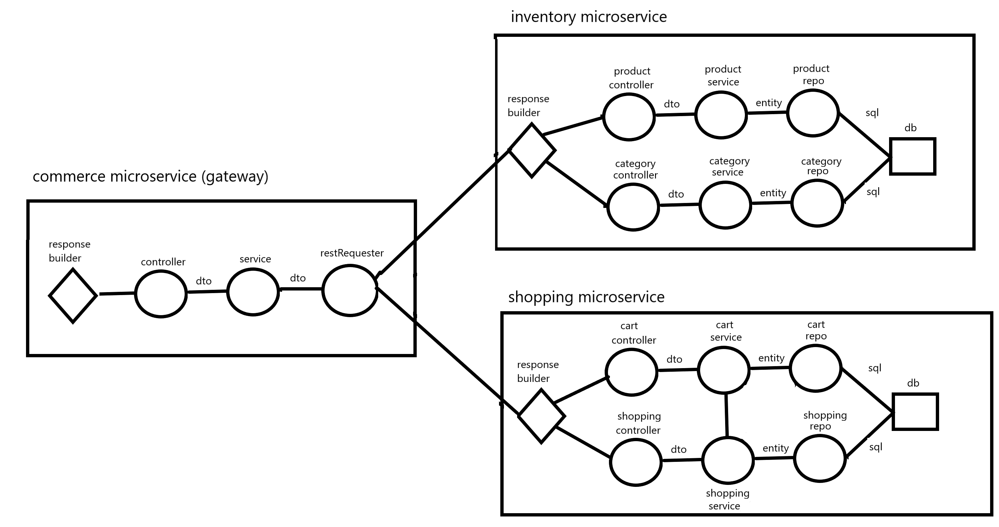

#### Inventory MicroService

Inventory class has two entity classes: Category and Product. It also includes Dtos of those classes. I did seperated the classes mostly according to this. Product has its own service and controller chained next to its repository. Category has same thing. We can access them from <code>localhost:8081/inventory/'</code> . We have 4 endpoint belongs to this service.
| Method Type | Route | Parameters | Response | Description |
| ----------- | --------------------------------- | ------------------------- | ----------------------- |----------------------------------------------------- |
| GET | **/categories** | None | List\<CategoryDto> | Return category list which shows all categories. |
| GET | **/addCategory/{category_name}** | Path variable, String category_name|\<CategoryDto> | Adds category to inventory.|
| GET | **/products/{categoryId}** | Path variable, Long category_id| List\<ProductDto> | Returns categories under given category|
| GET | **/product/{product_id}** | Path variable, Long product_id | ProductDto| return the requested product object.

#### Shopping MicroService

The Shopping service has 2 entities Cart and Cart Product. Shopping service is pretty similiar to inventory. It designed with similiar thoughts.

The Shopping service has <code>localhost:8082/shopping</code> prefix for the following routes.

| Method Type | Route                                   | Parameters                                      | Response     | Description                        |
| ----------- | --------------------------------------- | ----------------------------------------------- | ------------ | ---------------------------------- |
| GET         | **/cart/create/{customer_name}**        | Path variable String customer_name              | Long cart_id | Creates a cart and returns its id. |
| GET         | **/cart/checkout/{cart_id}**            | Path variable Long cart_id                      | String       | Returns status of cart checkout.   |
| GET         | **/cart/find/{cart_id}**                | Path variable Long cart_id                      | CartDto      | Returns the cart with given id.    |
| POST        | **/cart/add**                           | CartProductDto in request body                  | String       | Updates the CartProductDto.        |
| DELETE      | **/cart/{cart_id}/remove/{product_id}** | Path variables Long cart_id and Long product_id | String       | Removes product from cart.         |

#### Commerce MicroService

Commerce is not a microservice with a database connection but a gateway microservice with _RestRequest_ class. This RestRequest class provides it to have connections with different microservices. Analyzing available microservices dynamicly would be overkill for this project so I did not it. Instead, I implemeneted MicroserviceAddresses class. This class hold addresses of Inventory and Shopping microservices. If we prefer to change those addresses, updating MicroserviceAddresses class in this microservice should be enough.

I will not show endpoints of this class. This class has no extra endpoints to previous two table. You can access them via commerce from <code>loacalhost:8080/commerce</code>. You should add append <code>/inventory</code> or <code>/shopping</code> according which microservices you target.

But it does some extra operation in service layer such as completing Dtos which will require info from both microservices.

### Tests

I did use basic Junit tests in this project. Also I did some black box tests to make sure there is no obvious logic or calculation error.

**inventory:**

| categories                                           | product                                           |
| ---------------------------------------------------- | ------------------------------------------------- |
| 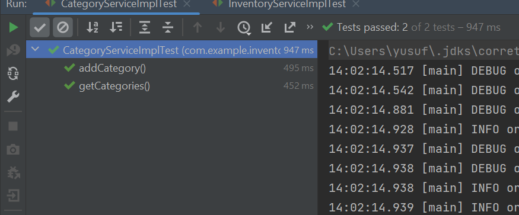 | 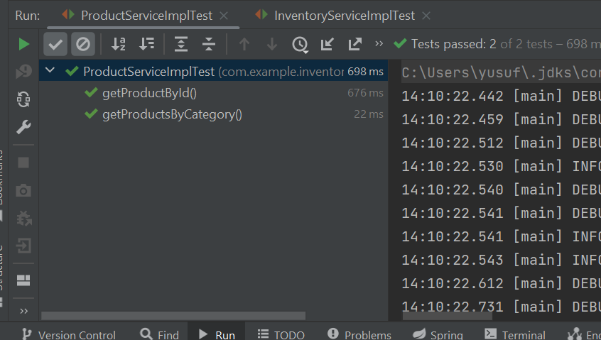 |

**shopping:**
|cart|shopping|
|-|-|
| 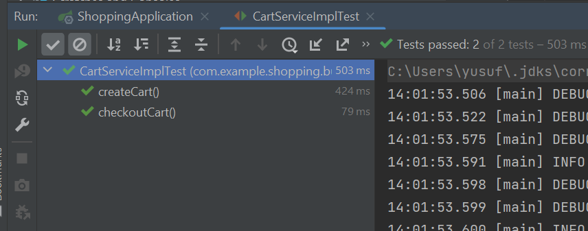 | 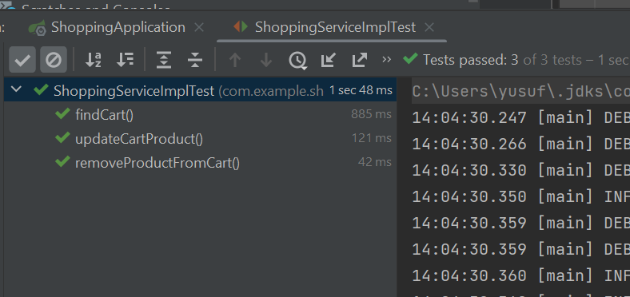 |

**commerce:**
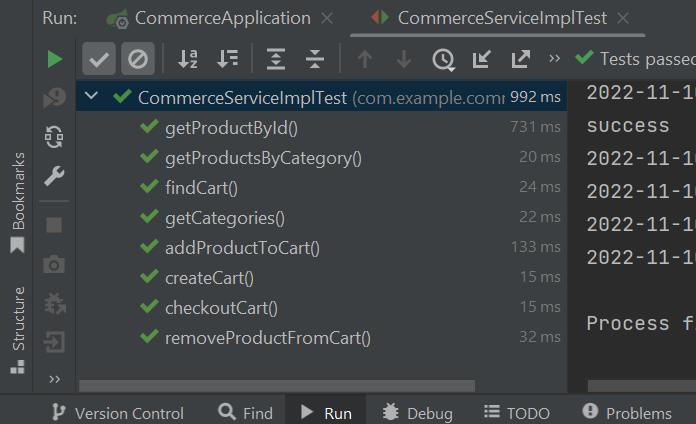

**Some postman outputs:**
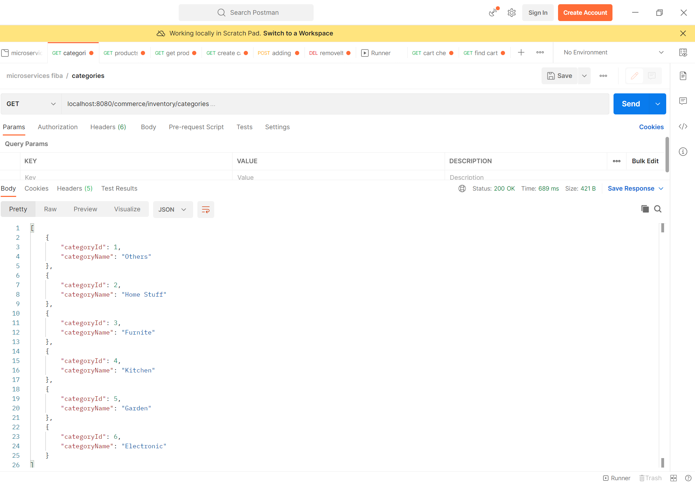
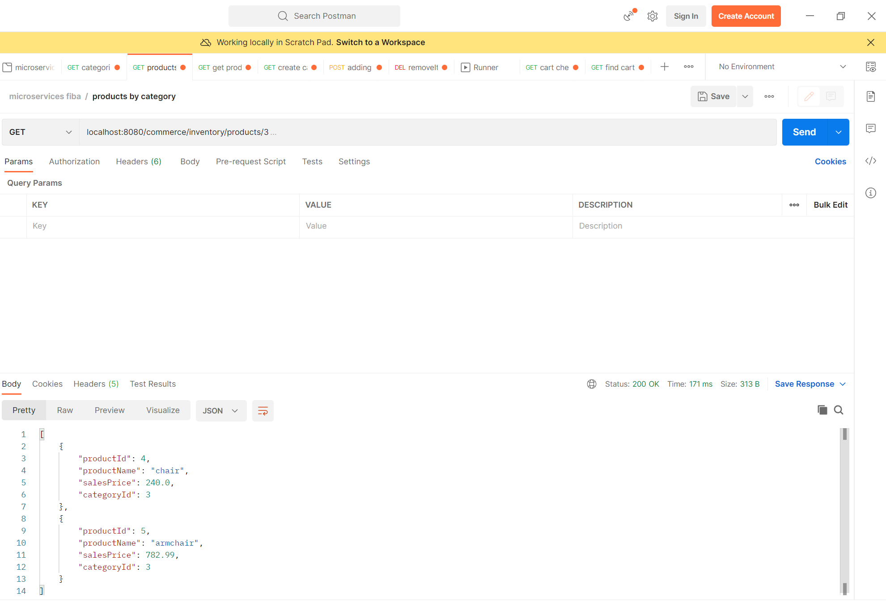
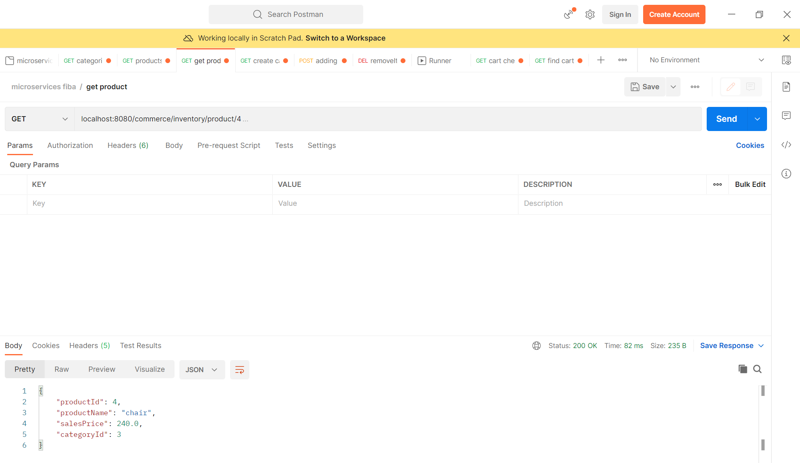

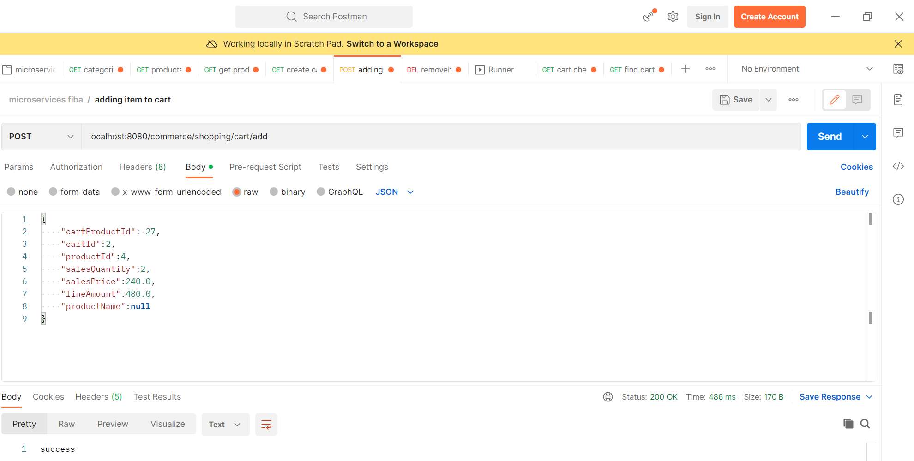
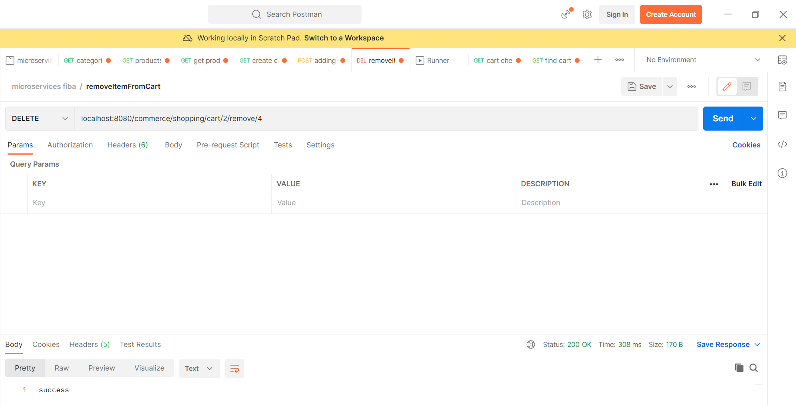

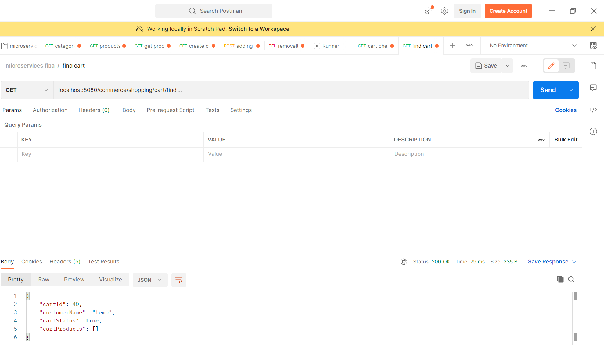
